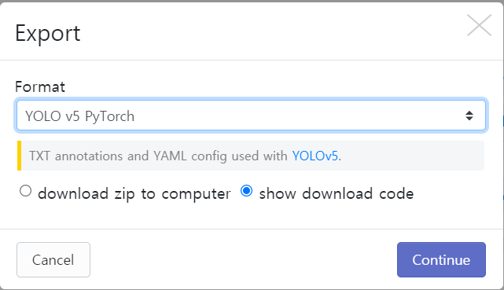
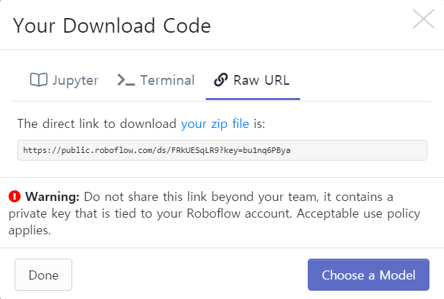
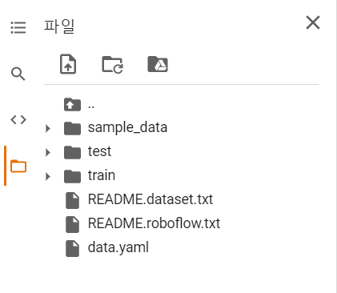
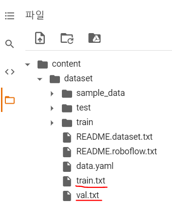
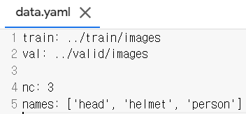
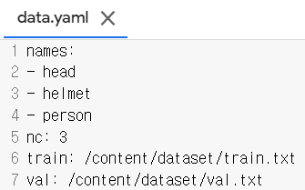
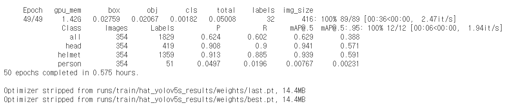

- [YOLO v5](#yolo-v5)
    - [개발 실습 환경](#개발-실습-환경)
- [1. 환경 세팅](#1-환경-세팅)
  - [1) 코랩 노트 생성](#1-코랩-노트-생성)
  - [2) 코랩 환경설정 및 성능 확인](#2-코랩-환경설정-및-성능-확인)
  - [3) 욜로에 쓰일 샘플이미지 데이터 받아오기](#3-욜로에-쓰일-샘플이미지-데이터-받아오기)
  - [4) 코랩에 데이터 셋 불러오기](#4-코랩에-데이터-셋-불러오기)
- [2. Yolo v5 사용해보기](#2-yolo-v5-사용해보기)
  - [1) 코랩에 Yolo v5 오픈소스 가져오기](#1-코랩에-yolo-v5-오픈소스-가져오기)
  - [2) 데이터 셋 나누기](#2-데이터-셋-나누기)
  - [3) 학습하기](#3-학습하기)
  - [4) 결과 확인](#4-결과-확인)

# YOLO v5

### 개발 실습 환경
- os : Window10
- Colab 

-------------------

# 1. 환경 세팅

## 1) 코랩 노트 생성

우리는 Google Colaboratory server (이하 코랩) 환경에서 실습을 할 예정이다.

아래 사이트는 코랩 주소이다. 

> https://colab.research.google.com

접속하여 새 노트를 실행한다.

```
좌상단 파일 -> 새 노트
```

`untitled.ipynb` 부분을 눌러 노트 이름을 지정한다.

나는 `yolov5.ipybn`로 저장하였다.

## 2) 코랩 환경설정 및 성능 확인

우선 이미지파일을 처리하려면 많은 연산이 필요하기에 런타임 유형을 GPU로 변경해준다.

```
상단 런타임 -> 런타임 유형 변경 -> GPU 선택 -> 코드 셀 출력 생략 체크 후 저장
```

아래 명령어들로 코랩 개발환경의 정보와 성능을 간단하게 확인할 수 있다.

```py
import platform
platform.platform()

# 운영체제
!cat /etc/issue.net

# cpu 사양
!cat /proc/cpuinfo

# 메모리 사양
!cat /proc/meminfo

# 디스크 사양
!df -h

# GPU 사양
!nvidia-smi
```

## 3) 욜로에 쓰일 샘플이미지 데이터 받아오기

Roboflow라는 사이트에서 데이터셋을 받아 올 것이다.

> https://roboflow.com/

접속하여 데이터 셋을 받아보자.

```
상단 Product -> All Features.. -> 좌측 Sharing
```


`free public versions of your datasets` 를 클릭하면 샘플 데이터들이 있다.

또는 아래 링크로 바로 접속

> https://public.roboflow.com

접속 후 아래로 내리다 보면 `Hard Hat Worker datset`이 있을 것이다. 우리는 이 데이터로 실습을 진행할 것이다. 클릭

`resize-416x415-reflect` 클릭

다운로드 포맷은 YOLO v5 PyTorch를 선택하고 show download code를 체크 후 컨티뉴



로그인 하라고 나오는데 로그인해준다. 나는 깃헙으로 로그인했다.

그러면 다운로드 코드가 나오는데 복사해두자.



이제 데이터를 받을 준비가 됐다.

다시 코랩으로 돌아간다.

## 4) 코랩에 데이터 셋 불러오기

아래 명령어를 코드창에 적고 실행하면 불러올 수 있다.

```sh
!curl -L "https://public.roboflow.com/ds/FRkUESqLR9?key=bu1nq6PBya" > roboflow.zip; unzip roboflow.zip; rm roboflow.zip
```

- 쌍따옴표 안의 주소는 2)에서 확인한 데이터셋 다운로드 링크이다.

- 명령어를 간단히 살펴보면 해당 링크에서 zip파일을 다운받고 unzip으로 압축해제하고 rm으로 zip파일을 삭제한다.

좌측 폴더모양 아이콘을 클릭하면 다운로드된 파일을 확인할 수 있다.



- test와 train 디렉토리 내에 images 폴더를 보면 샘플이미지들이 저장되어 있다.

- labels 폴더 내 파일내용에서는 각각의 이미지에서 헬멧들의 좌표와 사이즈를 확인할 수 있다.

    ```
    헬멧의 X좌표 / 헬멧의 Y좌표 / 헬멧이미지 너비 / 헬멧이미지 높이
    ```

dataset 폴더를 만들어 다운로드받은 파일들을 모두 옮겨주자.


-----------------------

# 2. Yolo v5 사용해보기

## 1) 코랩에 Yolo v5 오픈소스 가져오기

YOLO v5 깃헙 소스 클론

```sh
%cd /content

!git clone https://github.com/ultralytics/yolov5.git
```

/content 디렉토리에 소스파일이 다운로드됐다.

이제 Yolo v5에 필요한 패키지들을 다운로드 받는다.

```sh
%cd /content/yolov5/
!pip install -r requirements.txt
```

## 2) 데이터 셋 나누기

우선 Glob 패키지로 다운로드받은 모든 이미지의 개수를 확인한다. glob 패키지를 이용하면 유닉스 스타일로 파일에 접근하고 리스트로 관리할 수 있다.


> 참조 : Glob 패키지 공식문서
> 
> https://docs.python.org/3/library/glob.html


```py
%cd /

from glob import glob

img_list = glob('/content/dataset/test/images/*.jpg')
print(len(img_list))
```

- `*.jpg` 를 사용하기 위해 glob 패키지를 쓴 것 같다. *는 모든 파일명을 의미. 
- 확장자가 jpg인 모든 파일을 리스트에 넣은 것이다.
- 1766개의 이미지 개수를 확인할 수 있을 것이다.

이제 scikit-learn 라이브러리를 사용하여 데이터셋을 나눈다.

> 참조 : <a href="https://scikit-learn.org/stable/modules/generated/sklearn.model_selection.train_test_split.html?highlight=train_test_split#sklearn.model_selection.train_test_split">scikit-learn의 train_test_split 함수</a>

```py
from sklearn.model_selection import train_test_split

train_img_list, val_img_list = train_test_split(img_list, test_size=0.2, random_state=2000)

print(len(train_img_list), len(val_img_list))
```

- 데이터를 8:2 비율로 나누었다.
- 학습데이터 : 1412개
- 테스트데이터 : 352개

나눈 데이터들의 파일명을 텍스트로 저장한다.

```py
with open('/content/dataset/train.txt', 'w') as f:
    f.write('\n'.join(train_img_list) + '\n')

with open('/content/dataset/val.txt', 'w') as f:
    f.write('\n'.join(val_img_list) + '\n')
```



저장된 것을 확인할 수 있다.

내용을 보면 나뉜 이미지 파일들의 절대경로 + 파일명이 적혀있다.

이제 이 train.txt와 val.txt의 내용으로부터 데이터를 불러올 수 있게 `data.yaml` 파일 내용을 수정한다.

아래는 yaml 라이브러리를 사용해 파일입출력으로 파일내용을 수정하는 코드이다.

```py
import yaml

with open('/content/dataset/data.yaml', 'r') as f:
    data = yaml.load(f)

print(data)

data['train'] = '/content/dataset/train.txt'
data['val'] = '/content/dataset/val.txt'

with open('/content/dataset/data.yaml', 'w') as f:
    yaml.dump(data, f)

print(data)
```

수정 전



수정 후



- 그냥 파일을 열어서 직접 타이핑쳐서 수정해도 된다.

## 3) 학습하기

```sh
%cd /content/yolov5/

!python train.py --img 416 --batch 16 --epochs 50 --data /content/dataset/data.yaml --cfg ./models/yolov5s.yaml --weights yolov5s.pt --name hat_yolov5s_results
```

- train.py 파일이 있는 디렉토리로 이동한 후 학습파일 소스코드 실행.
- --img : 이미지 크기
- --batch : 배치 크기
- --epochs : 학습 횟수
- --data : data.yaml 파일경로
- --cfg : 모델 크기에 따라 x, s, m, l. 이중 s 사용
- --weights : 가중치 선택
- --name : 결과를 저장할 파일명


상당히 오래 걸릴 것이다..

## 4) 결과 확인



학습에 약 30분이 소요되었다.

학습결과는 `runs/train/hat_yolov5s_results/test_batch_pred.jpg` 파일을 열면 확인할 수 있다.


첫번째 이미지를 테스트 폴더에서 찾아보았다.


반사된 헬멧도 헬멧으로 인식하였다.